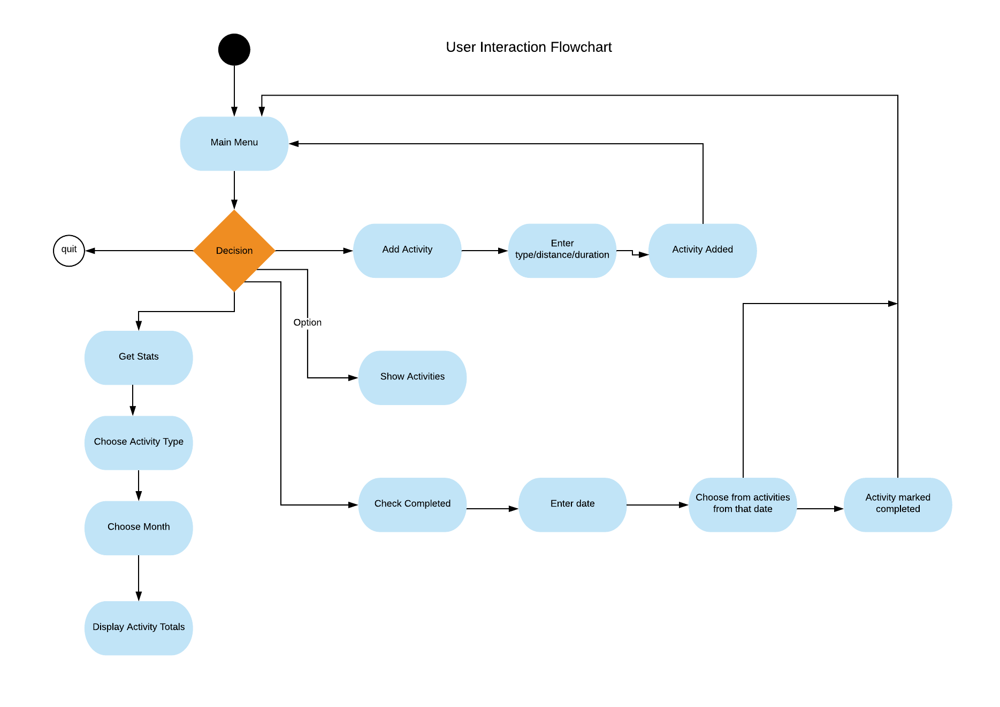

Application Source Code
---
https://github.com/tessssssssy/terminal-app

Purpose of the application
---
My application is an exercise planning and recording app. The application has multiple features. Users can schedule future workouts and log past workouts, recording workout type, distance, duration and date. They can also check off workouts as completed and view workout stats

What problem is this app trying to solve
---

This application aims to be a motivational tool to encourage people to get more exercise. It builds users accountability to an exercise plan by allowing them to plan future workouts and check them off as they are completed. 

Target Audience
---
The app is intended for anyone who is interested in starting an exercise plan and want to record their workouts. The app is focused on exercises with the ability to record time and distance, including running, cycling, swimming, walking and hiking so would be particularly suited to people who are interested in those activities. 

How the audience will use the application
---
Users will use the application to plan and then track their 


Application Features
---
1. Users can log completed workouts and record details icluding:

- workout type: run, ride, swim or walk/hike
- distance
- duration
- date completed

2. Users can schedule future workouts in the same way they log past ones. Recording the planned workout type, distance, duration and the date they want to complete it.

3. View a table of all workouts and their details. These are colour coded, with different colours for completed, incomplete past workouts and future planned workouts.

4. Users can check off completed activities. This will change the colour of the activity in the view table. When a past activity is logged, it is checked completed automatically.

5. Get workout stats. Users can view the total distance and duration for each workout type, and see their longest workouts by distance and duration. Users can choose to see totals and personal records for a specific months or view all.

User Interaction
---
1. Users will type their name/username as a command line argument when they run the application

2. The user will choose an option from a main menu: 
- add activity
- show activities
- check completed activity
- get stats
- quit: quits the application

3. The user will then be directed to one of the sub menus:
- add activity: asked to input activity type, distance, duration and date
- show activities: displays a table listing all the users activities
- check-completed-activities: asks the user for a date, then shows a list of activities on that date for the user to check off
- get stats: asks user to enter activity type and month, then shown a table of activity totals/personal records

4. If the user ever enters an invalid input, the application will detect it and ask them to try again

User Interaction Diagram
---


R9 Implementation Plan
---
Develop an implementation plan which:
- outlines how each feature will be implemented and a checklist of tasks for each feature
- prioritise the implementation of different features, or checklist items within a feature
- provide a deadline, duration or other time indicator for each feature or checklist/checklist-item

Utilise a suitable project management platform to track this implementation plan

> Your checklists for each feature should have at least 5 items.


Documentation
---

Installation

```bash

gem install terminal-app

```

Gemfile

```ruby

gem 'terminal-app', '~> 0.1.0'

```

Install Dependencies

```bash
bundle install
```

Running the application

```bash
ruby terminal-app <username>
```
